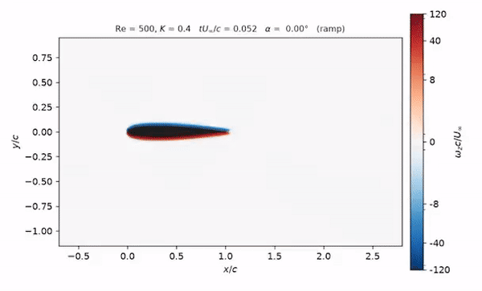
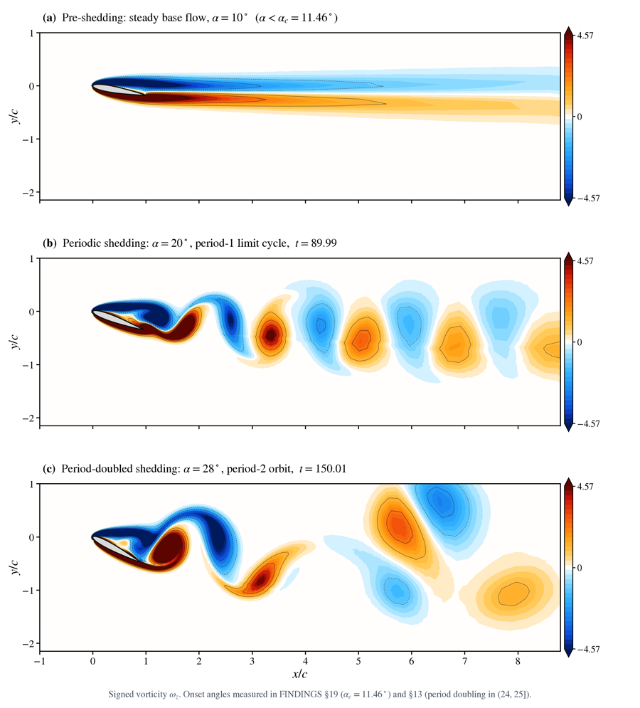
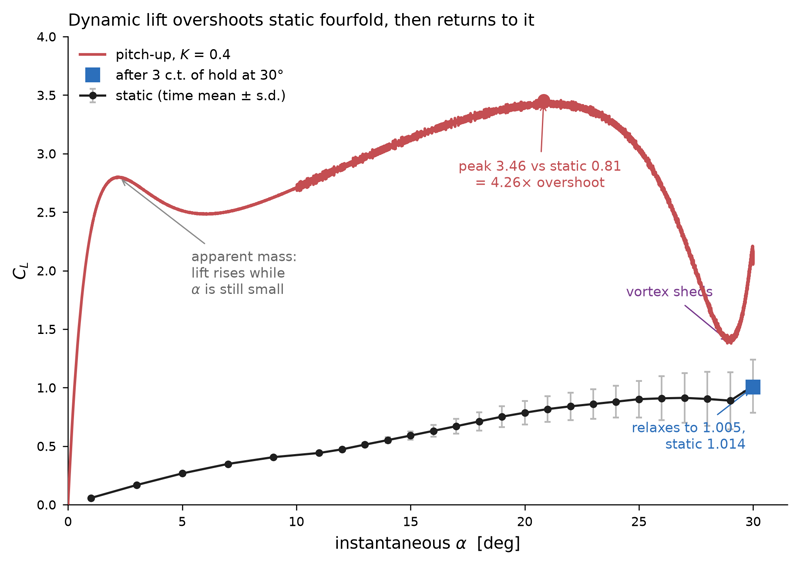
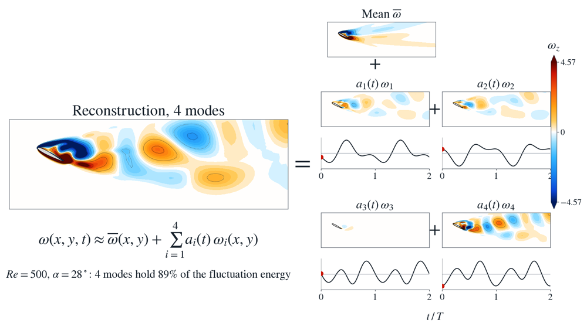
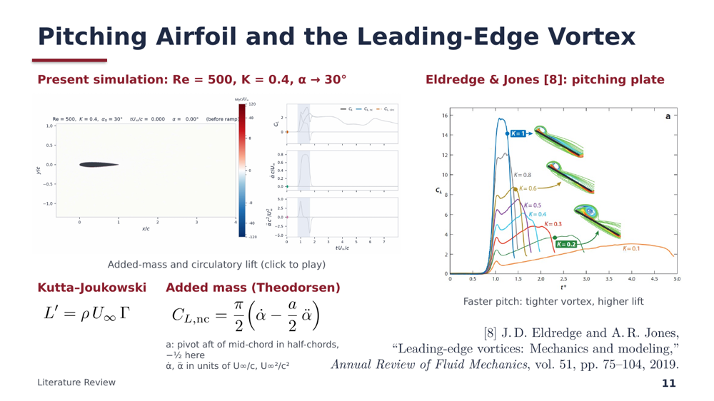

# BSc thesis predefense: report and slides

**Modeling and Control of Unsteady Flows over Rapidly Maneuvering Airfoils at Ultra-Low Reynolds Number**
Imdadullah Raji (2110099), Abdullah Al Mamun (2110062) · Supervisor: Dr Md Ali
Department of Mechanical Engineering, BUET · Predefense, 30 September 2026

This repo holds the sources for our predefense report and talk. The large files (PDFs, decks, figures, videos) are on Google Drive. [`archive/README.md`](archive/README.md) explains how to get them back.

---

## 1. What it is about



When a small wing pitches up fast, a **leading-edge vortex** rolls up on top of it and the lift briefly shoots far above its static value (animation on the right). We want a **reduced-order model** of this flow: a model with only a few degrees of freedom that still captures the physics, so that it can run fast enough for real-time control.

Plan of the thesis:
1. Characterize the flow physics of a pitching NACA0012 at low Reynolds number (2D OpenFOAM simulations).
2. Find a low-dimensional representation of the flow with data-driven methods (POD, DMD, SINDy).
3. Build a reduced-order model that predicts the lift for a given pitching input.
4. Check whether that model is robust enough for flow control.

The predefense covers the literature review, the simulation methodology, and the first results. The reduced-order model and the control part are still to come.

### Results so far

**Stationary airfoil at Re = 500.** As the angle of attack increases, the wake goes from steady, to periodic shedding (onset at α ≈ 11.5°), to period-doubled shedding (between 24° and 25°).



**Pitch-up maneuver** (Re = 500, K = 0.4, 0° → 30°). Peak lift is about 4.3× the static value at the same angle. After the hold, the lift relaxes back to the static value.



**Why a low-order model is plausible.** At α = 28°, four POD modes hold 89% of the fluctuation energy.



**The talk** has ~13 generated slides plus results slides. Here is one of them:



### Where things are

| Path | What |
|---|---|
| `markdowns/` | My own notes: literature review, objectives, methodology. Everything else was built from these. |
| `texFiles/`, `build.sh` | LaTeX source of the report → `predefense.pdf` |
| `writeup/` | Two versions of the report: an *author* copy with red boxes marking missing evidence, and a clean *reader* copy |
| `slides_mds/` | My slide-by-slide spec and style rules for the talk |
| `scripts/build_slides.py`, `scripts/speaker_notes.py` | Generate `slides/predefense.pptx` and `slides/speaker_notes.pdf` |
| `scripts/`, `static_case/`, `figs/pitch_plot_digitized/` | Figure, video, mesh-rendering and word-count scripts |
| `UNRESOLVED_BEFORE_DEFENSE.md` | Open issues and questions to expect at the defense |
| `archive/` | Git/Drive split and the asset sync scripts |

---

## 2. How all of this was made (honestly)

**I did not write the LaTeX or the PowerPoint code by hand.** I don't know how to use python-pptx, and I didn't need to. Here is what actually happened.

**What I did:**
- Ran the simulations: OpenFOAM cases and my post-processing in [openfoam_cases](https://github.com/Imdadullah-Raji/openfoam_cases) and [flowkit](https://github.com/Imdadullah-Raji/flowkit). These repos are separate from this one.
- Wrote the content as plain markdown in `markdowns/`: the literature review, objectives, and methodology (`methodology_writeup.md` is my original).
- Wrote the slides as markdown in `slides_mds/`: what goes on each slide, which figure or video, my speaker notes, plus `slides_styles.md` with layout rules (high contrast for a bad projector, a 7-minute talk, references at the bottom of each slide, page numbers).
- Reviewed every output, sent back corrections, and decided what stayed in.

**What Claude (Opus 5.5, in Claude Code) did:**
- **Report:** turned my markdowns and figures into the LaTeX in `texFiles/`, wrote `build.sh`, checked my claims against the papers in `reference_sources/`, and fixed equations. It noted every correction in `markdowns/SOURCE_NOTES.md` and flagged missing results instead of inventing them. It also made the author/reader versions in `writeup/`.
- **Slides:** wrote `scripts/build_slides.py` (~700 lines of python-pptx). The script reads my `slides_mds/`, renders the equations with LaTeX, numbers the references, embeds the videos, and writes the `.pptx`. Speaker notes come from `scripts/speaker_notes.py`. Notes Claude drafted where mine were missing are marked `[drafted]`.
- **Figures and videos:** the scripts that render the mesh, make the wake and POD videos, digitize a published plot for the benchmark overlay, and count words.
- **Bookkeeping:** `UNRESOLVED_BEFORE_DEFENSE.md`, and the git/Drive archive setup in `archive/`.

So the work splits like this: **the physics, the data, the content and the judgement calls are mine. The typesetting, the slide engineering and most of the plotting code are Claude's.**

### Workflow, if you want to do the same

1. **Write content in markdown first**, one file per section, in your own words. Get the physics right here, not in LaTeX.
2. **Write a slide spec in markdown:** one heading per slide, the content, the figure or video path, and speaker notes. Put style rules in a separate file.
3. **Ask Claude Code to build from those files**, in the same folder as your figures and data. Ask it to generate the outputs with a script (LaTeX, python-pptx), so you can rebuild after every edit instead of editing a binary deck.
4. **Make it list what it can't verify.** A "missing evidence" box in the draft or an UNRESOLVED file is worth more than a polished paragraph that's wrong.
5. **Rebuild, read the PDF and the deck, correct, repeat.** Keep editing your markdown or the script, not the output.
6. **Archive:** code to git, heavy files to cloud storage (see `archive/`).

### Rebuilding

```bash
archive/pull_assets.sh            # fetch figures/videos/PDFs from Drive first
./build.sh                        # report -> predefense.pdf   (pdflatex, detex)
python3 scripts/build_slides.py   # talk   -> slides/predefense.pptx
                                  # (python-pptx, Pillow, lxml, numpy; pdflatex, pdftocairo, ffmpeg, rsvg-convert)
```
