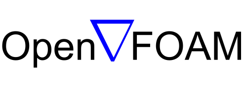
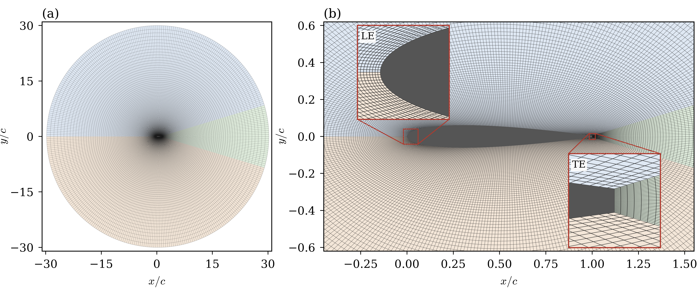
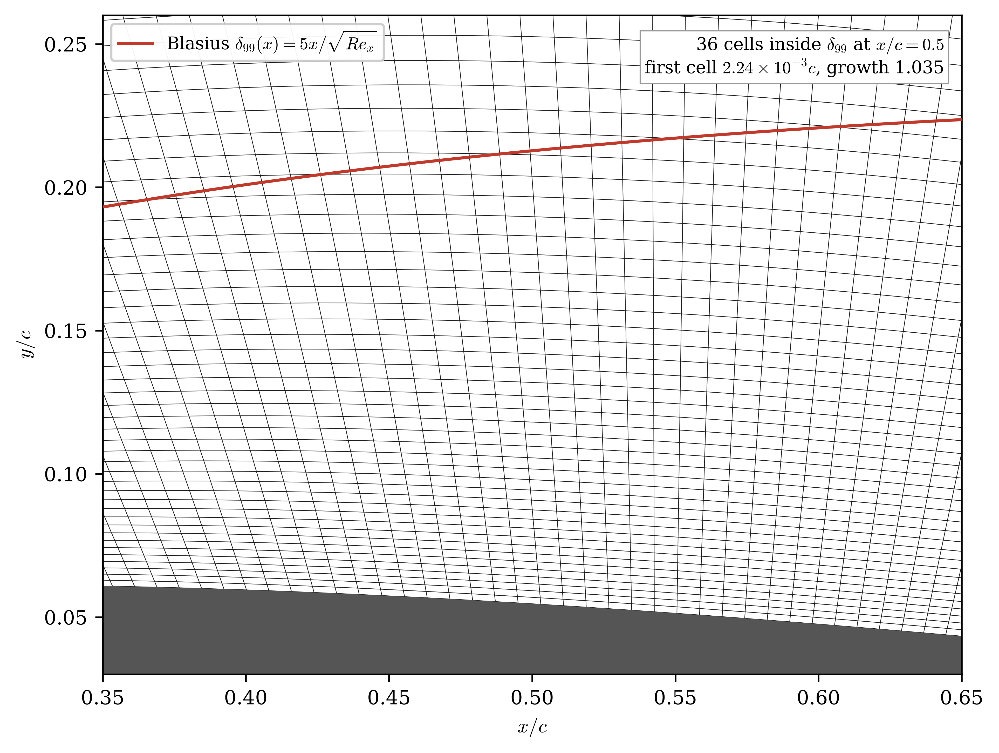

# Methodology 

*The slide markdown headings here are not intended to be the actual slide headings.*

*The text content of the slide is to be determined from the 
speakers notes*

## Slide 1: Solver

>The 1998 paper by Weller, Jasak et al to be referenced. Construct the text contents of the slide from the speakers note.

### Media
- OpenFOAM logo 

### Text Content

**NB**: The AI Agent has freedom to edit the contents in this table. This is just a specimen. Use the report for content.
|Point|Info|
|---|---|
| Simulation Type | 2D Laminar DNS, no Turbulence model|
| Compressibility | Ignored |
| Unsteady Solver type | PISO/PIMPLE |
| Convection  | second-order upwind |
|Time-stepping | second-order implicit|

### Speakers Note 
*est. time: 20s*
The simulations were conducted in the open-source finite 
volume code OpenFOAM. The problem concerns unsteady fluid 
flows at low-Reynolds number. Flow is laminar, hence the smallest scale to resolve is the boundary layer thickness $\delta$. We solve the Navier-Stokes directly without any turbulence model. Flow is also assumed to be incompressible. Second order schemes were used both convection and time-stepping. 

## Slide 2: Mesh Stats 

### Media 
- Mesh view 
- Boundary Layer Resolution . This image can be made smaller. 

### Text Content
- Blasius flat plate scaling
- **Table**: Mesh statistics table : parse from the report.A small table with at most 4 entries, it should not clutter the slide, it contains two images already. 

### Speakers Note:
*est. time: 25 s*
The simulation domain is a disk 30 chord-length radius. When angle of attack needs changing we rotate the freestream instead of the airfoil. The first layer height is taken to be approximately the hundredth of the blasius flat plate boundary layer thickness. Together with the growth rate it ensure that the boundary layer remains resolved by approximately 40 or so cells. 

## Slide 3: Pitch Motion and Arbitrary Lagrangian Eulerian

### Media
- Mesh Motion Animation: Find mesh motion snapshots at 
`/home/raji/Research/Thesis/mesh_motion_anime` 

### Content
- Show the ALE NS equation, refer to the report. The mesh motion equation. 

The pitch motion is handled by rotating the entire mesh relative to the freestream. This introduces an additional convective term per cell, due to mesh motion.(*The speaker points to the $u_m$). This numerical technique is called Arbitrary-Lagrangian Eulerian, as it solves the Eulerian Navier-Stokes with arbitrary lagrangian motion of the cells. 

